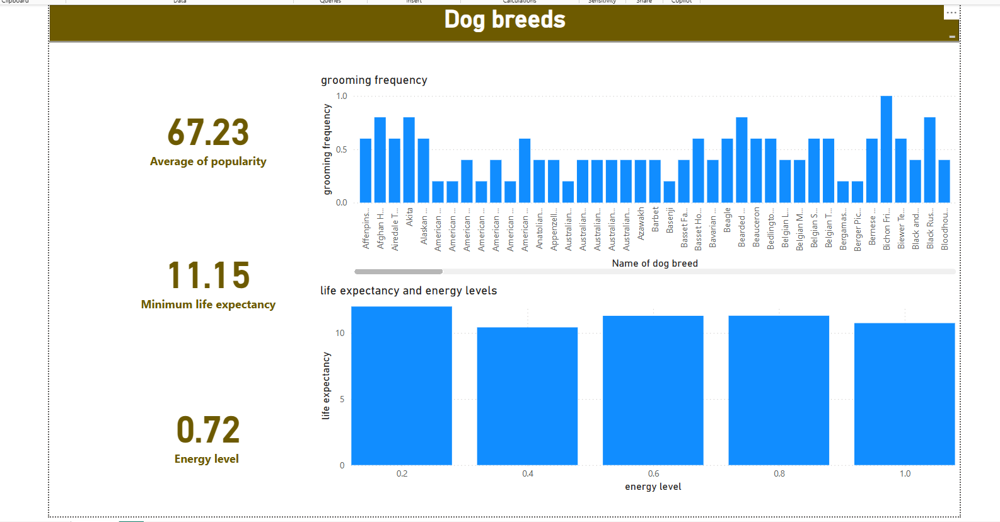

# Dog Breeds Analysis Project

## Project Overview

This project explores patterns across different dog breeds, focusing on popularity, energy levels, and life expectancy.

The goal was not just to visualize data, but to provide good insights — particularly between energy level and lifespan, and how that might influence breed popularity.

---

## Tools Used

- **Excel** – Initial data exploration, restructuring, and handling missing values  
- **Power BI** – Dashboard development and insight visualization  

---

## Dataset Source

- Dataset obtained from **Kaggle**

---

## Project Workflow

1. Loaded and reviewed the dataset in Excel.
2. Cleaned the data by:
   - Rearranging columns for better structure
   - Ensuring consistency in categorical fields
3. Imported the cleaned dataset into Power BI.
4. Designed an dashboard to show information on:
   - Breed popularity
   - Energy levels
   - Average lifespan

---

## Key Insights

- **Energy vs Lifespan Relationship:**  
  A noticeable trend emerged where breeds with higher energy levels often had shorter lifespans, while lower-energy breeds tended to live longer.

- **Popularity Trends:**  
  Medium-energy breeds appeared to be the most preferred overall, suggesting that owners may favor a balance between activity and manageability.

---

## Dashboard Preview

---

## Skills shown

- Ability to clean and prepare structured data
- Identifying insights , correlations and behavioral trends
- Building dashboards 

