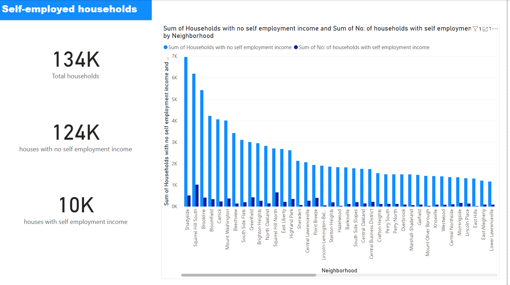

# Household_income project
Shows households that have self-employed income and ones that don't in neighbourhoods.

## Tools Used
- Power BI (to visualize the data)
- OpenRefine (to clean the dataset)

## Process
- I first loaded the data into OpenRefine.
- Renamed/deleted columns, clustered values, handled blanks etc.
- Then exported it to excel and then to power BI to further visualize.

## Key Insights
- The number of households with self-employed income was not significant.
 
## Screenshot of dashboard 
-

